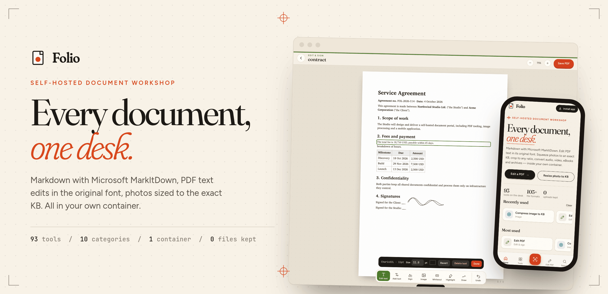
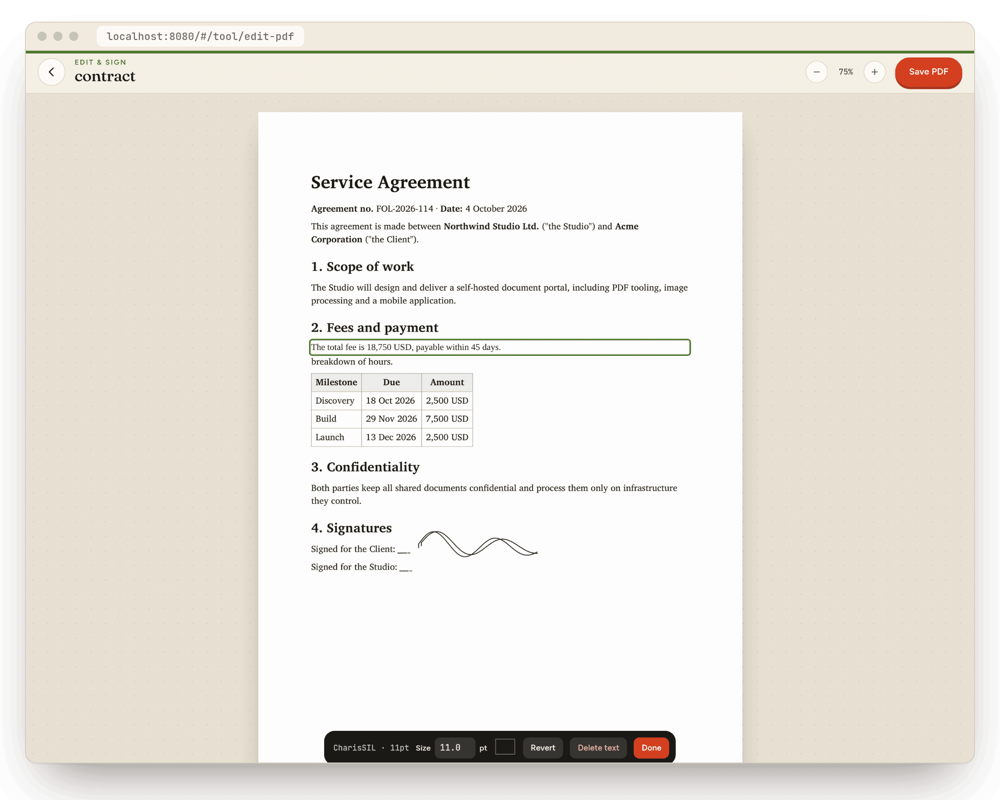
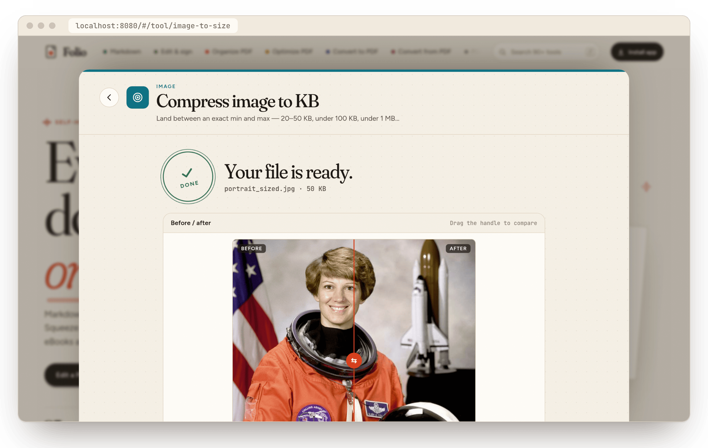
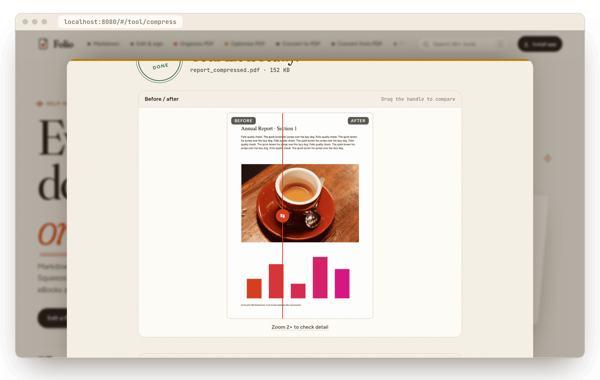
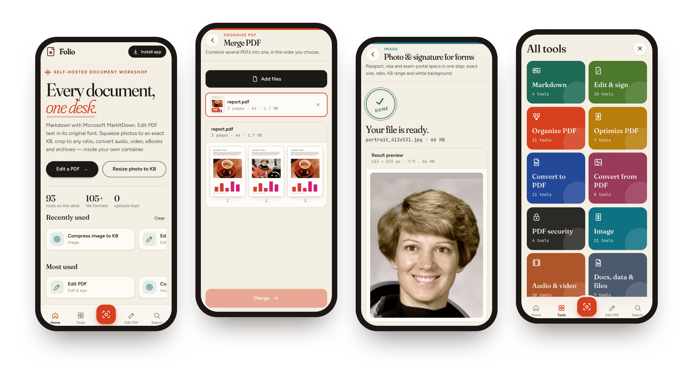
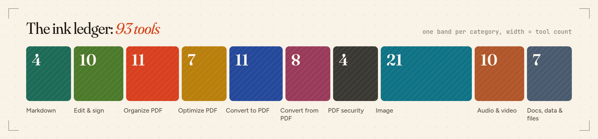
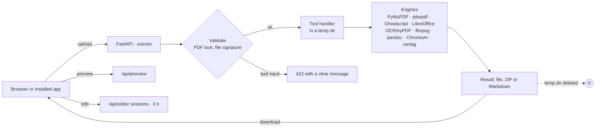

<div align="center">

<picture>
  <source media="(prefers-color-scheme: dark)" srcset="docs/assets/hero-dark.png">
  
</picture>

<br>

[](#quick-start)
[](requirements.txt)
[](app/main.py)
[](https://github.com/microsoft/markitdown)
[](#the-tool-catalogue)
[](#on-your-phone)

**[Quick start](#quick-start)** &nbsp;·&nbsp; **[What it does](#what-it-does)** &nbsp;·&nbsp; **[Tools](#the-tool-catalogue)** &nbsp;·&nbsp; **[API](#rest-api)** &nbsp;·&nbsp; **[Phone](#on-your-phone)** &nbsp;·&nbsp; **[Under the hood](#under-the-hood)**

</div>

<br>

Online converters ask you to upload contracts, IDs and family photos to someone else's server. **Folio** puts the
same everyday tools, and a few they don't have, on a machine you control. Every file is processed inside one
container and deleted the moment you download the result.

## Quick start

```bash
git clone https://github.com/amit33748/folio.git
```

```bash
cd folio
```

```bash
docker compose up -d --build
```

Open **http://localhost:8080**. The API reference is at `/api/docs` and a health check at `/api/health`.

> [!NOTE]
> The first build pulls LibreOffice, Chromium, Tesseract and an ONNX background-removal model. Plan for about
> 5 GB of disk and 2 to 4 GB of RAM. Rebuilds after code changes take seconds.

<br>

## What it does

### Change the words, keep the typeface

Tap any line in a PDF and retype it. Folio reuses the document's **own embedded font** when it has the glyphs you
need. Word exports normally carry trimmed subset fonts; Folio rebuilds their Unicode map from the document itself so
they stay usable. When a glyph truly isn't there, it uses the same family or a metric twin (Calibri → Carlito,
Arial → Liberation Sans). Size, colour and baseline stay exactly where they were. Add text, sign, white out,
highlight, draw and fill forms in the same view.



### Exact sizes for the forms that demand them

Upload portals ask for things like *"JPG, 20–50 KB, 3.5 × 4.5 cm"* or *"PDF under 200 KB"*. Folio treats those as
targets, not hopes:

- **Compress image to KB:** set a min and max. Pixels shrink before JPEG quality drops below 50, so results stay sharp instead of blocky.
- **Photo & signature for forms:** passport, visa and exam presets with head-and-shoulders framing and an optional AI white background.
- **Resize** in px, %, mm, cm or inches with DPI. **Crop** to any ratio, face-aware, with plain or blurred padding.
- **Compress PDF to size**, **split PDF by size**, **compress video to a target MB** (two-pass), **reframe video** to 9:16, 1:1 or 16:9.



### See it before you keep it

Every upload is previewed the moment it lands: numbered pages for PDF, Word, PowerPoint, Excel and eBooks, pixel
size and aspect ratio for photos, resolution and duration for video. Results get the same treatment, and single-file
results open in a **before/after slider** with 2× zoom so you can judge compression quality yourself.



### A workshop in your pocket

Folio installs as an app. On a phone you get a bottom tab bar, a camera **Scan** button that straightens page edges,
full-screen tools with a pinned action button, and the system share sheet: send a PDF from any app straight into a
tool. "Continue with…" carries each result into the next step, so Merge → Compress → Protect is three taps.



### Markdown that language models like

Powered by [Microsoft MarkItDown](https://github.com/microsoft/markitdown): PDF, Office, HTML, EPUB, ZIP, JSON,
images and web pages (YouTube included) become clean, structured Markdown with rendered and raw views.

```bash
curl -F files=@quarterly-report.pdf http://localhost:8080/api/tools/pdf-to-markdown
```

```json
{ "kind": "markdown", "docs": [ { "name": "quarterly-report.md", "markdown": "# Quarterly report\n\nRevenue grew **18%**…" } ] }
```

<br>

## The tool catalogue

<picture>
  <source media="(prefers-color-scheme: dark)" srcset="docs/assets/ledger-dark.png">
  
</picture>

<details>
<summary><b>Markdown</b> &nbsp;<sub>4 tools</sub></summary>
<br>

| Tool | What it does |
|---|---|
| Anything to Markdown | PDF, Word, PowerPoint, Excel, HTML, EPUB, ZIP, JSON, images |
| PDF to Markdown | Headings, lists and text as structured Markdown |
| Office to Markdown | Word, PowerPoint and Excel with tables kept |
| Web page to Markdown | Articles, Wikipedia, YouTube transcripts |
</details>

<details>
<summary><b>Edit & sign</b> &nbsp;<sub>10 tools</sub></summary>
<br>

| Tool | What it does |
|---|---|
| Edit PDF | Change existing text in its original font; add text, images, shapes |
| Sign PDF | Draw, type or upload a signature and place it anywhere |
| Fill PDF form | Text fields, check boxes, drop-downs |
| Add watermark | Text or logo, any angle and opacity |
| Add page numbers · Header & footer | Position and format; `{page}` `{total}` `{date}` `{file}` placeholders |
| Crop PDF · Flatten PDF | Trim margins; burn in fields and annotations |
| Compare PDF | Side-by-side text diff of two versions |
| Edit metadata | Title, author, subject, keywords |
</details>

<details>
<summary><b>Organize PDF</b> &nbsp;<sub>11 tools</sub></summary>
<br>

| Tool | What it does |
|---|---|
| Merge PDF | Combine in any order |
| Split PDF · Split PDF by size | Ranges, every page, fixed chunks, or parts under an MB limit |
| Remove pages · Extract pages · Reorder pages | Drop, keep, reorder, reverse, odd-then-even |
| Rotate PDF | 90°, 180°, 270°; all or selected pages |
| Pages per sheet (N-up) | 2, 4, 6 or 9 per sheet |
| Alternate & mix | Interleave front and back scans |
| Insert blank pages · Remove blank pages | Add pages, or detect and drop empty ones |
</details>

<details>
<summary><b>Optimize PDF</b> &nbsp;<sub>7 tools</sub></summary>
<br>

| Tool | What it does |
|---|---|
| Compress PDF | Light 225 dpi, Recommended 150 dpi, Extreme 100 dpi |
| Compress PDF to size | Exact KB or MB target, legible by default |
| Resize PDF pages | A3, A4, A5, B5, Letter, Legal, Tabloid or custom mm |
| Repair PDF | pikepdf, then MuPDF, then Ghostscript recovery |
| OCR PDF | Searchable text in 7 languages (OCRmyPDF) |
| Grayscale PDF · Fast web view | Remove colour; linearize with qpdf |
</details>

<details>
<summary><b>Convert to PDF</b> &nbsp;<sub>11 tools</sub></summary>
<br>

| Tool | What it does |
|---|---|
| Word, PowerPoint, Excel to PDF | LibreOffice rendering |
| Images to PDF | Fit to image, A4 or Letter, margins, orientation |
| Scan to PDF | Phone camera, edge detection, perspective fix, optional OCR |
| Markdown to PDF · Text to PDF | Typeset documents; monospaced code and logs |
| HTML to PDF · Web page to PDF | Headless Chromium |
| eBook to PDF | EPUB, MOBI, FB2, CBZ, XPS |
| PDF to PDF/A | PDF/A-2b for archiving |
</details>

<details>
<summary><b>Convert from PDF</b> &nbsp;<sub>8 tools</sub></summary>
<br>

| Tool | What it does |
|---|---|
| PDF to Word | *Editable text* (pdf2docx) or *Exact layout* (LibreOffice, charts kept) |
| PDF to PowerPoint · PDF to Excel | Slide per page with notes; detected tables per sheet |
| PDF to JPG / PNG / WebP | 72 to 300 dpi |
| PDF to Text · HTML · SVG | Plain text, self-contained page, vector pages |
| Extract images | Embedded pictures at original resolution |
</details>

<details>
<summary><b>PDF security</b> &nbsp;<sub>4 tools</sub></summary>
<br>

| Tool | What it does |
|---|---|
| Protect PDF | AES-256 with print, copy and edit restrictions |
| Unlock PDF | Remove the password from a PDF you own |
| Redact PDF | Removes the text itself, plus emails and phone numbers |
| Remove metadata | Author, XMP, JavaScript, embedded files |
</details>

<details>
<summary><b>Image</b> &nbsp;<sub>21 tools</sub></summary>
<br>

| Tool | What it does |
|---|---|
| Compress image · Compress image to KB | Quality slider; min/max KB range with quick presets |
| Resize image · Crop to aspect ratio | px, %, mm, cm, inch + DPI; face-aware crop, pad, blurred pad |
| Photo & signature for forms | Passport 35×45 mm, US 2×2 in, visa, Canada, exam presets, custom |
| Convert image | HEIC, WebP, AVIF, PNG, JPG, GIF, BMP, TIFF, ICO, PDF |
| Remove background | AI cut-out (rembg) to transparent or any colour |
| Blur faces | Blur, pixelate or black box |
| Rotate & flip · Adjust & filters | Any angle; brightness, contrast, saturation, sharpen, sepia |
| Watermark image · Meme generator | Text or logo, corner or tiled; captions |
| Enlarge image | 1.5× to 4× Lanczos with sharpening |
| Remove EXIF & GPS · View file metadata | Lossless strip; full exiftool report |
| Image to text (OCR) | Document, columns, screenshot layouts |
| Image to SVG · SVG to PNG / PDF | vtracer tracing; cairo rendering |
| Make animated GIF · Photo collage · Web page to image | Animation, grid, Chromium screenshot |
</details>

<details>
<summary><b>Audio & video</b> &nbsp;<sub>10 tools</sub></summary>
<br>

| Tool | What it does |
|---|---|
| Convert video | MP4, WebM, MOV, MKV, AVI |
| Compress video | Quality level or exact target size (two-pass) |
| Resize & reframe video | 9:16, 1:1, 4:5, 16:9, 21:9; crop, bars or blurred fill; 360p to 4K |
| Trim audio / video | Frame-accurate or instant |
| Video to GIF · Video to images | Optimised palette; frames every N seconds |
| Convert audio · Extract audio | MP3, M4A, WAV, FLAC, OGG, Opus; bitrate, mono, loudness |
| Mute video · Change speed | No re-encode; 0.5× to 4× with natural pitch |
</details>

<details>
<summary><b>Docs, data & files</b> &nbsp;<sub>7 tools</sub></summary>
<br>

| Tool | What it does |
|---|---|
| Convert document | DOCX, DOC, ODT, RTF, Markdown, HTML, EPUB, LaTeX, RST, TXT, PDF |
| Convert spreadsheet & data | XLSX, XLS, ODS, CSV, TSV, JSON, XML, HTML, Markdown, PDF |
| Convert presentation | PPTX, PPT, ODP, PDF, PNG slides |
| Create archive · Extract / convert archive | ZIP, 7z (optional password), TAR.GZ |
| Convert font | TTF, OTF, WOFF, WOFF2 |
| eBook to Markdown / EPUB | EPUB, FB2, MOBI to Markdown, text, EPUB, Word |
</details>

<br>

## On your phone

1. Open Folio in the phone's browser. On Android tap **Install app**; on iOS use **Share → Add to Home Screen**.
2. Installed on Android, Folio appears in the **share sheet** of every app.
3. Installing and sharing need **HTTPS** (or `localhost`). Put Folio behind a TLS reverse proxy for phones on your
   network, for example with Caddy:

```caddyfile
folio.example.lan {
    reverse_proxy localhost:8080
    request_body {
        max_size 500MB
    }
}
```

## REST API

Every tool is one endpoint. `GET /api/tools` lists IDs, accepted types and options with defaults. Send files as
`files` (repeat for several) and options as form fields.

```bash
# a PDF under 200 KB
curl -F files=@big.pdf -F target=200 -F unit=kb http://localhost:8080/api/tools/compress-pdf-to-size -o small.pdf
```

```bash
# a photo between 20 and 50 KB
curl -F files=@me.jpg -F min_size=20 -F max_size=50 -F size_unit=kb http://localhost:8080/api/tools/image-to-size -o me.jpg
```

```bash
# a 9:16 reel with a blurred fill
curl -F files=@clip.mov -F aspect=9:16 -F fill=blur -F res=1080 http://localhost:8080/api/tools/resize-video -o reel.mp4
```

| You get | When |
|---|---|
| The file (`Content-Disposition`) | One result |
| A ZIP | Several results |
| `{"kind": "markdown", "docs": [...]}` | Markdown and text tools |
| `422 {"error": "…"}` | Bad, locked or damaged input, with a message you can show users |

Headers `X-Original-Size`, `X-Result-Size`, `X-Folio-Note` (URL-encoded) and `X-Folio-Target-Met` report what a
size-target tool achieved.

<details>
<summary><b>Editor and preview endpoints</b></summary>
<br>

| Call | Purpose |
|---|---|
| `POST /api/editor/open` | `file`, optional `password` → `{sid, pages: [{w, h, spans, widgets}]}` |
| `GET /api/editor/{sid}/page/{n}.jpg?w=1200` | Page image |
| `GET /api/editor/{sid}/font/{xref}` | Embedded font, for on-screen editing |
| `POST /api/editor/{sid}/save` | `{"ops": [...]}`: `edit-text`, `add-text`, `image`, `rect`, `highlight`, `line`, `field` |
| `DELETE /api/editor/{sid}` | End the session (they also expire after 3 h) |
| `POST /api/preview` | `file`, optional `first`, `count`, `width` → page or frame thumbnails |
</details>

## Configuration

| Setting in `docker-compose.yml` | Default | Purpose |
|---|---|---|
| `ports` | `8080:8000` | Where the app is served |
| `MAX_UPLOAD_MB` | `500` | Total upload size per request |
| `ALLOW_PRIVATE_URLS` | unset | `1` lets the web-page tools reach intranet addresses |
| `tmpfs /tmp` | `4g` | In-memory scratch for uploads, results and editor sessions |

## Under the hood



**Quality guards that matter in practice**

- Size targets shrink pixels before quality, PNGs go through pngquant with dithering, and PDF compression stays at or
  above 100 dpi unless you opt in to strong loss.
- Password-protected or damaged PDFs are refused up front; Ghostscript output is page-count checked, so a "success"
  can never be a file of blank pages.
- Office, archive and eBook files are checked by their file signature before any converter sees them.

<details>
<summary><b>Project structure</b></summary>
<br>

```
app/
├── main.py           FastAPI app: uploads, validation, responses, static files
├── registry.py       Tool registry, categories and shared helpers
├── tools_pdf.py      Markdown (MarkItDown) and PDF tools
├── tools_image.py    Image tools, form photos, background removal, OCR
├── tools_media.py    Audio and video (ffmpeg)
├── tools_files.py    Documents, spreadsheets, presentations, archives, fonts, eBooks
├── editor.py         Font-preserving PDF editor API
├── preview.py        Upload and result previews
└── static/           Vanilla HTML/CSS/JS app, editor, service worker, manifest, icons
docs/assets/          README artwork (rendered from HTML with headless Chromium)
```
</details>

<details>
<summary><b>Adding a tool</b></summary>
<br>

A tool is a function plus metadata; the interface builds its form automatically.

```python
from .registry import PDF, Result, num, out_path, tool


@tool(
    id="pdf-stamp", name="Stamp PDF", category="edit", glyph="watermark",
    description="Put a short stamp in the top-right corner of every page.",
    accept=PDF,
    options=[
        {"name": "text", "label": "Stamp text", "type": "text", "default": "APPROVED", "required": True},
        {"name": "size", "label": "Font size", "type": "range", "min": 8, "max": 48, "default": 18},
    ],
)
def pdf_stamp(files, opts, work):
    import pymupdf as fitz

    doc = fitz.open(files[0])
    for page in doc:
        page.insert_text((page.rect.width - 160, 40), opts["text"], fontsize=num(opts, "size", 18), color=(0.8, 0.1, 0.1))
    out = out_path(work, files[0], ".pdf", "stamped")
    doc.save(out)
    return Result("file", out)
```

- **Option types:** `text` `url` `password` `textarea` `number` `range` `color` `checkbox` `select` `segmented`
  `cards` `chips` `grid9` `file`.
- **Behaviour:** `when` shows an option conditionally, `sets` turns a select or chips option into presets, and
  `half: true` pairs fields on one row.
- **Errors and notes:** raise `ToolError("…")` for a 422 the user can read; `meta={"note": "…"}` adds a note to the result.

To iterate on the front end without rebuilding, mount `./app/static:/srv/app/static:ro` in `docker-compose.yml`.
</details>

## Security and privacy

> [!WARNING]
> Folio has **no built-in login**. Keep it on a private network, or put it behind a reverse proxy with
> authentication before anyone outside can reach it.

- **Your files:** they live in a per-request directory on tmpfs and are deleted after the response. Logs record
  request lines and, for failures, error tracebacks that can include file names; never file contents.
- **The container:** it runs as an unprivileged user.
- **URL tools:** they refuse private, loopback and link-local addresses (SSRF guard).
- **Archives and uploads:** extraction rejects path traversal, and upload file names are sanitised.
- **Redaction:** it removes the underlying text; still review redacted files before sharing.

## Limitations

- **Editing text:** each edit is written as one run, so paragraphs don't reflow, and complex scripts such as
  Devanagari conjuncts aren't shaped. Scans need OCR before their text can be edited.
- **PDF to Word:** *Editable text* can drop vector charts; use *Exact layout* when looks matter.
- **Enlarge image:** classical resampling, not AI super-resolution.
- **RAR archives:** not supported, because the decoder isn't free software.
- **MarkItDown extras:** audio transcription calls an online speech service, and image captioning needs an LLM,
  which isn't configured.
- **Image size:** about 4.6 GB.

## Troubleshooting

| You see | Do this |
|---|---|
| `failed to connect to the docker API` | Start Docker Desktop or the Docker daemon |
| Large uploads fail | Raise `MAX_UPLOAD_MB` and the tmpfs size; check proxy body limits |
| "…is password protected" | Run **Unlock PDF**, or enter the password in the editor |
| "…isn't a readable PDF" | Run **Repair PDF** |
| A size target wasn't met | It's below what stays legible; raise it or allow strong quality loss |
| No install button on the phone | Serve over HTTPS or `localhost` |
| Old interface after an update | Reload once; the service worker refreshes itself |

## Credits and licences

Built on [MarkItDown](https://github.com/microsoft/markitdown) (MIT), [PyMuPDF](https://github.com/pymupdf/PyMuPDF)
(AGPL-3.0 or commercial), [pikepdf](https://github.com/pikepdf/pikepdf) (MPL-2.0), [Ghostscript](https://www.ghostscript.com/)
(AGPL-3.0), [qpdf](https://github.com/qpdf/qpdf) (Apache-2.0), [LibreOffice](https://www.libreoffice.org/) (MPL-2.0),
[OCRmyPDF](https://github.com/ocrmypdf/OCRmyPDF) (MPL-2.0), [Tesseract](https://github.com/tesseract-ocr/tesseract)
(Apache-2.0), [pdf2docx](https://github.com/ArtifexSoftware/pdf2docx) (AGPL-3.0), [FFmpeg](https://ffmpeg.org/) (LGPL/GPL),
[pandoc](https://pandoc.org/) (GPL-2.0), [Chromium](https://www.chromium.org/) (BSD), [rembg](https://github.com/danielgatis/rembg)
(MIT), [OpenCV](https://opencv.org/) (Apache-2.0), [vtracer](https://github.com/visioncortex/vtracer) (MIT),
[pngquant](https://pngquant.org/) (GPL-3.0), [ExifTool](https://exiftool.org/) (Artistic/GPL),
[fontTools](https://github.com/fonttools/fonttools) (MIT) and [FastAPI](https://fastapi.tiangolo.com/) (MIT).
Type: Fraunces, Figtree and JetBrains Mono (SIL OFL).

> [!IMPORTANT]
> PyMuPDF, Ghostscript, pdf2docx and pngquant are AGPL or GPL. Private use is unaffected; if you offer Folio as a
> service to others or redistribute the image, review those obligations or obtain commercial licences.

Feature research drew on iLovePDF, iLoveIMG, CloudConvert, Convertio,
[Stirling-PDF](https://github.com/Stirling-Tools/Stirling-PDF) and [BentoPDF](https://github.com/alam00000/bentopdf).

<div align="center">
<br>
<sub>Made for people who would rather not upload their passport to a stranger's server.</sub>
</div>
